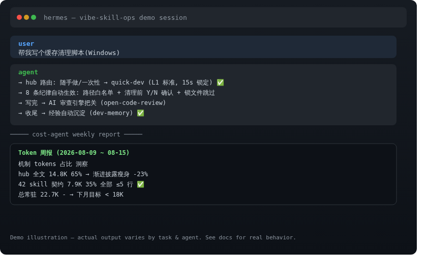
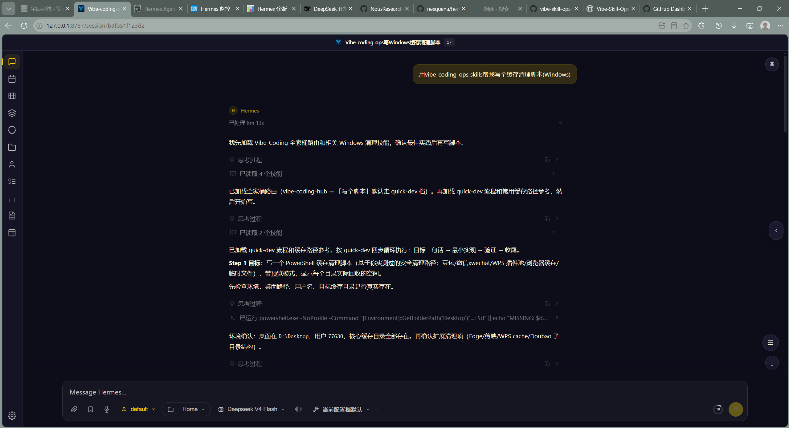
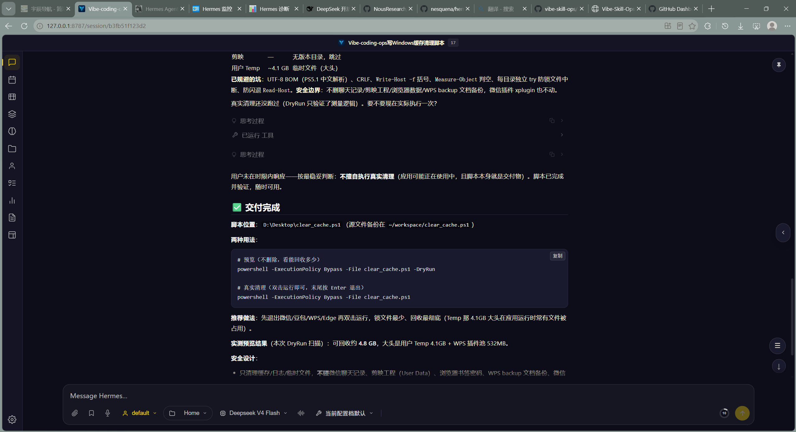

<div align="center">

# Vibe-Skill-Ops

**A pluggable skill pack for [Hermes Agent](https://github.com/NousResearch/hermes-agent)** — 42 battle-tested skills that give your agent: automatic workflow routing, built-in security discipline, cross-session memory, and AI code review.

[](README.md) [](README.zh-CN.md) [](https://github.com/yuchen1017918/vibe-skill-ops/releases) [](LICENSE)

</div>

<div align="center">

| | |
|---|---|
| <span style="color:#58a6ff">**Runtime**</span><br/>Hermes Agent | <span style="color:#3fb950">**Install**</span><br/>3 seconds | <span style="color:#d29922">**Language**</span><br/>Markdown only | <span style="color:#f85149">**License**</span><br/>MIT |
| <span style="color:#8b949e">**Skills**</span><br/>42 (29 active) | <span style="color:#bc8cff">**Degradation**</span><br/>Graceful → plain mode | <span style="color:#ff7b72">**Lock-in**</span><br/>Zero | <span style="color:#7ee787">**Proven**</span><br/>Field-tested end-to-end |

</div>

---

## 🎯 What Problem Does It Solve?

| Without it, you… | After installing |
|------------------|------------------|
| 😩 Re-teach your agent *"my workflow"* on every new project; it keeps asking *"what next?"* | **One phrase triggers it**: say *"use the family workflow"* or *"build an MVP"* — the agent routes itself to the right skill, locked in within 15 seconds |
| 😰 Rely on coding discipline by vibes: hardcoded secrets, SQL injection, dangerous shell commands — discovered in production | **8 silent disciplines + commit gate**: secure-by-default writing, automatic pre-commit scan, SQLi interception verified in real tests |
| 😵 Switch sessions/platforms and lose all project context; re-explain everything | **Snapshot + dual-layer memory**: say *"continue where we left off"* — instant resume; lessons learned auto-persist, never re-trip the same pit |
| 🤯 No one reviews code quality; eyeballing PRs | **AI review engine**: one-command line-level review, found 2 critical bugs in 12s (DeepSeek-backed, field-tested) |
| 💸 Token spend grows with no idea where it goes | **Cost dashboard + progressive disclosure**: mechanisms load on demand, resident context minimized, weekly report shows where tokens went |

> Three sentences: **Install-and-use now, no loss if you don't** (enhancement, not dependency — degrades gracefully to plain mode); **mechanisms load on demand** (never stuff the whole family into context); **delete any skill and the system still works** (Great Simplicity).



**Real run** — CachePilot, a Windows cache-cleaner built end-to-end with this family (auto-routed → 8 disciplines → AI review → delivered):

<p align="center">
  
  
</p>

---

## ⚡ 3-Second Install

### Option 1: One-shot prompt (recommended)

Send this line to your AI agent (Hermes Agent / Claude Code / Codex…), it reads the tutorial and installs itself:

> 💬 `https://yuchen1017918.github.io/vibe-skill-ops/Tutorial.md, please download and install this vibe-coding skill family for me.`

### Option 2: Manual

```bash
# 1. Clone
git clone https://github.com/yuchen1017918/vibe-skill-ops.git /tmp/vibe-skill-ops

# 2. Install: copy the family into Hermes skills dir (default profile)
mkdir -p ~/.hermes/skills
cp -r /tmp/vibe-skill-ops/vibe-coding-family ~/.hermes/skills/

# 3. Verify
find ~/.hermes/skills/vibe-coding-family -name SKILL.md | wc -l   # 42 (29 active + 6 hub + 7 deprecated)

# 4. Use: just start a dev task — the agent auto-routes via vibe-coding-hub
#    (or say "按全家桶流程来" / "make an MVP" / "继续上次")
```

**What your agent becomes after install**: say *"write me a script"* → quick-dev; *"team development"* → dev-team pipeline; *"release"* → release-ops (auto-backup + rollback plan); *"continue where we left off"* → instant snapshot resume.

---

## 🖼 Before vs After

```
  Before (plain Hermes Agent)              After (+ 42 skills)
  ┌─────────────────────────┐        ┌──────────────────────────────┐
  │ User: "build an X"       │        │ User: "build an X"            │
  │ Agent: "ok, where do we  │  ───▶  │ Agent: auto-routes in 15s    │
  │  start?"                 │        │   ├ unclear? → clarify       │
  │ You: (manually teach…)   │        │   ├ coding → 8 disciplines   │
  │                         │        │   ├ done → AI review          │
  │ Same grind every project │        │   ├ release → backup+rollback│
  │ New session = start over │        │   └ wrap-up → auto learn     │
  │ Secrets by vibes, pits   │        │ User: "continue" → instant   │
  │  by memory               │        │  resume                      │
  └─────────────────────────┘        └──────────────────────────────┘
```

---

## 📦 What Is It? (30-second version)

**Vibe-Skill-Ops is a set of Markdown skill documents plus a routing framework.** Installed into Hermes Agent's skills directory, it upgrades your agent from *"a tool that needs instructions for every sentence"* to *"an engineering assistant that knows which method to use."*

- **Four-layer routing**: organization form (team/enterprise) → dev mode (assistant/full-control) → scenario → execution skill — routes by *scale + who's driving*, not by tech type
- **Five capability lines**: main flows (vibe-coding/dev-team) · security three-layer defense · dual-layer memory (dev/vuln) · quality gate (AI review) · parallel & routing
- **Graceful degradation**: if anything breaks, the agent falls back to native mode — enhancement, not dependency
- **Extensible**: distill your own workflows into user-custom skills that coexist with the family (see `workflow-distillation`)

> ⚠️ Honest boundary: this is **Markdown documentation (skills)**, not executable software. No background processes. "Auto-trigger" means the agent loads a skill and follows its conventions; reliability ceiling = the agent's instruction-following ability.

---

## 🗺 Architecture at a Glance

```
vibe-coding-family/
├── vibe-coding-hub/            # L1: entry hub — four-layer routing + one-line profile + global mechanisms
├── dev-core-hub/               # L2 index: core dev (main flows / coding / debug / test / commit)
├── dev-stack-hub/              # L2 index: tech stack (languages / frontend / DB / game engines)
├── dev-infra-hub/              # L2 index: infra (terminal / containers / MCP / deploy / security)
├── dev-agent-hub/              # L2 index: agent orchestration & governance
├── dev-ai-hub/                 # L2 index: AI/ML (training / inference / RAG / multimodal)
└── 29 routable L3 skills        # tool ×14 / workflow ×7 / policy ×6 / meta ×2
    └── plus 7 deprecated files kept for cross-reference safety (not routed)

external/                       # Copies of external skills referenced by the family (related_skills deps)
    └── 27 (language/platform/tool skills; for repo completeness/distribution only, not routed)
```

L3 skills use the `metadata.hermes.type` frontmatter tag to define invocation style:

| Type | Meaning | Example |
|------|---------|---------|
| `tool` | A concrete task with input/output | snapshot-notes, security-audit, china-env-adapt |
| `workflow` | A staged process | project-init, agent-ops, release-ops, workflow-distillation |
| `policy` | Standing discipline, injected when relevant | karpathy-coding-dscpln, frontend-design-policy, cost-agent |
| `meta` | Governs other skills | fallback-general-dev, vibe-skills-gov-patterns |

**Four-layer routing**:

```
L1  Org form      Team (lightweight)          Enterprise (large)
                 ┌──────────────┐           ┌──────────────┐
L2  Dev mode     │ Assistant │ Full │        │ Assistant │ Full │
                 └──────────────┘           └──────────────┘
L3  Scenario     four-quadrant scenario table (routing table, no extra docs)
L4  Exec skill   concrete skills (dev-assistant / quick-dev / vibe-coding / dev-team)
      ↕ tech hubs demoted to L2 indexes (dev-core / dev-stack / dev-infra / dev-agent / dev-ai)
```

---

## ⚙️ Core Mechanisms

| Mechanism | Version | What it does |
|-----------|---------|--------------|
| **Complexity Triage** | v1.0.0 | 5-question yes/no checklist → L0/L1/L2; dynamic calibration from actual cost/retry data |
| **One-line profile routing** | v1.1.0 | 【org】【driver】【type】【tech】locks L1+L2 in 15s; rebuttals update the profile, not re-route |
| **Default-path execution** | v1.1.0 | 5 common scenarios skip judgment; conflicting triggers → arbitration |
| **Intervention depth L0-L4** | v1.1.0 | dev-assistant tiers: Q&A → guidance → draft → co-pilot → full drive; blocking confirm on cross-file changes |
| **Escalation ceiling** | v1.1.0 | fallback upgrade ≤6 steps hard cap; prompt at step 3; human at step 6; 5-min loop detection |
| **Evidence consumption** | v1.1.0 | cost-agent weekly one-line insight + monthly forced decision |
| **Merge review** | v1.1.0 | trigger overlap >50% / 30-day unused / one-sided references → merge candidates; 7-day cooling for new skills |
| **Cost awareness** | v1.0.0 | token estimate per workflow task; `/simple` degradation; weekly report + ROI dashboard |
| **Confirmation SLA** | v1.0.0 | Blocking / Notify / Batch confirmation tiers with timeouts; `/focus 30m` DND |
| **Trigger governance** | v1.0.0 | namespace rules + conflict arbitration; context-bound & negative triggers |
| **Snapshot health check** | v1.5 | conflict classification 🟢🟡🟠🔴 vs git (source of truth); manual-confirm alignment |
| **Circuit breaker** | v1.4 | CLOSED/OPEN/HALF-OPEN state machine; timeout tiers; error-type disposition matrix |
| **Knowledge extraction** | v2.0 | merged into snapshot-notes: post-incident 5-Whys + structured experience |
| **Security audit** | v1.1 | 6-dimension pre-commit scan; rule tiers (🔴 never degrade); false-positive feedback loop |
| **Meta-governance** | v1.4 | event-driven audits; 30-day deprecation cooling period |
| **Lazy-load contract layer** | v1.1.0 | description = contract (≤5 lines); body = detail (on demand); prevents context crowding |
| **User workflow layer** | v1.0 | distill user workflows → user-custom skills that override standard (workflow-distillation) |

> Plain-language version: routing picks the right skill (15s), discipline keeps code safe (zero cost), memory prevents re-tripping pits (auto), review backs quality (one command), mechanisms load on demand (saves tokens).

---

## 📜 Version History

| Version | Theme | Highlights |
|---------|-------|-----------|
| v3.1 | Foundation | 3-layer disclosure, 18 self-built L3 skills, fallback protocol |
| v3.2 | System governance | L1 decision tree, L2 boundary declarations, skill type tags, scenario templates |
| v3.3 | Self-healing | Complexity Triage, snapshot health check, security audit, experience recall |
| v3.4 | Constraints & boundaries | Triage checklist, conflict-classified alignment, circuit breaker, cost awareness |
| v3.5 | Cognitive enhancement | knowledge-extraction, confirmation SLA, project-context weighting, smart /simple, meta-governance |
| v1.0.0 | Official release | Promoted from internal v3.6: trigger governance, lazy-load contract layer, execution-drift log, compatibility contract |
| **v1.1.0** | **Official release** | **Great Simplicity + structure rework. Four-layer routing; dev-assistant co-pilot protocol; quick-dev all-in-one; 3 merged skill groups; one-line profile; contract layer ≤5 lines** |
| **v1.2.0** | **Official release (current)** | **Security × quality × memory × parallel. Security three-layer defense (SQLi hook verified); AI review engine (2 critical bugs in 12s); dual-layer memory + metrics loop; git-worktree + reverse-ops auth gate; doubt-driven + context-engineering; workflow distillation (user layer); end-to-end field validation** |

---

## 🧭 Design Philosophy

1. **Great Simplicity** — token × quality is a product, not a trade-off; fewer mechanisms = cheaper to load and more accurate to execute. Delete a skill and see if the system crashes.
2. **Enhancement, not dependency** — losing the family degrades the agent to plain mode; work continues.
3. **Automation, not impunity** — every auto action has a human-confirmation threshold; the final say belongs to the user.
4. **Evidence over imagination** — execution-drift logs, triage-accuracy logs, and ROI dashboards drive iteration instead of author intuition.

---

## 🤝 Contributing

See [CONTRIBUTING.md](CONTRIBUTING.md) — new skills must carry a ≤5-line contract layer, pass a 7-day cooling period, and prove they can't be composed from existing skills.

## 🐋 DeepSeek Harness 适配版

使用 DeepSeek Harness (dsh)?全家桶有官方格式适配版(`deepseek-harness/`,36 skills,description ≤500 字符,由 `scripts/convert-dsh.py` 自动生成):

```bash
mkdir -p ~/.agents/skills && cp -r deepseek-harness/vibe-coding-family/* ~/.agents/skills/
```

详见 [deepseek-harness/README.md](deepseek-harness/README.md)。

## 🔒 Security

See [SECURITY.md](SECURITY.md) — security architecture, vulnerability reporting, and the three-layer defense model.

## License

MIT License — see [LICENSE](LICENSE).
